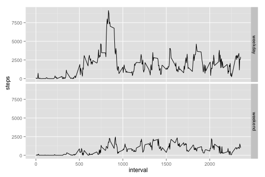

### Loading and preprocessing the data

```r
setwd("/Users/summerge/Documents/Learning R/RR")
library(dplyr);library(ggplot2);library(knitr);library(mice)
actives_data <- read.csv("activity.csv")
by_date_actives <- group_by(actives_data, date)
totalsteps_preday <- summarise(by_date_actives, steps = sum(steps, na.rm = T))
```
###Mean total number of steps taken per day


```r
summary(totalsteps_preday$steps)
```

```
##    Min. 1st Qu.  Median    Mean 3rd Qu.    Max. 
##       0    6778   10400    9354   12810   21190
```

### Average daily activity pattern
#### Time series plot of the 5-minute interval

```r
by_interval <- group_by(actives_data, interval)
meansteps_preinterval <- summarise(by_interval, steps = mean(steps, na.rm = T))
qplot(interval, steps, data = meansteps_preinterval, geom = "line")
```

 

####maximum number of steps

```r
meansteps_preinterval[which.max(meansteps_preinterval$steps),]
```

```
## Source: local data frame [1 x 2]
## 
##   interval    steps
## 1      835 206.1698
```

###Imputing missing values

```r
actives_imp <- mice(actives_data, seed = 1234, print=FALSE)
actives_new <- complete(actives_imp)
by_actives_new <- group_by(actives_new, date)
actives_total <- summarise(by_actives_new, steps = sum(steps))
qplot(steps, data = actives_total,geom = "histogram", binwidth = 2000)
```

 

```r
summary(actives_total$steps)
```

```
##    Min. 1st Qu.  Median    Mean 3rd Qu.    Max. 
##      41    9819   11460   12140   15080   23130
```

```r
weekends <- function(date){
  t = weekdays(date)
  ifelse((t == "Sunday") | (t == "Saturday"), "weekend", "weekday")
}
actives_new <- transform(actives_new, date = as.Date(date))
actives_new <- transform(actives_new, week = weekends(date))
by_week <- group_by(actives_new, week, interval)
by_week <- summarise(by_week, steps = sum(steps))
qplot(interval, steps, data = by_week, facets = week~., geom = "line")
```

 
